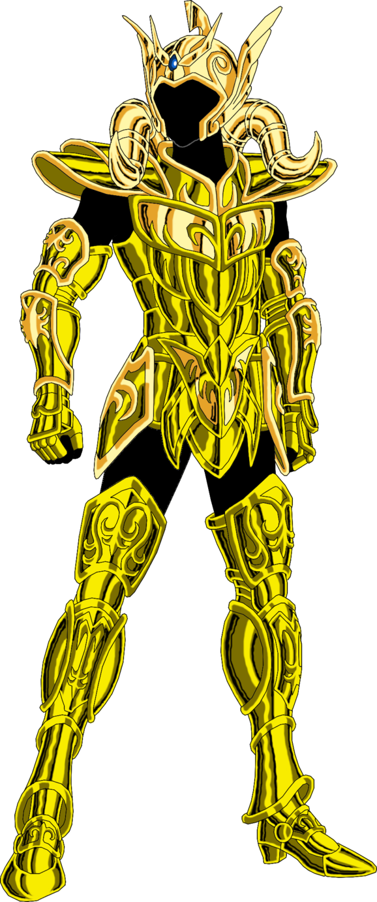

# Aries

Este servicio está encargado de verificar la valides de los token enviamos por un proveedor, además de comprobar las credenciales de un usuario, específicamente, el token de autenticación creado por [Taurus](https://github.com/Finciero/opendata/taurus).

Esta validación se hace por medio de un request HTTP hacia nuestro servidor principal Sigiriya, quien retorna la valides de este token.

Además, validamos el token de acceso de dicho partner consultando al Servicio de [Capricornius](https://github.com/Finciero/opendata/capricornius).

Una vez validadas las llaves de acceso, se realiza un request hacia el Servicio de [Geminis](https://github.com/Finciero/opendata/gamini) con los datos del usuario autenticado, este último servicio realiza las respectivas consultas de saldo y transacciones de dicho usuario.

Si las credenciales son correctas, Mu espera la respuesta de [Geminis](https://github.com/Finciero/opendata/gamini) que contiene el balance de las tarjetas de dicho usuario.
