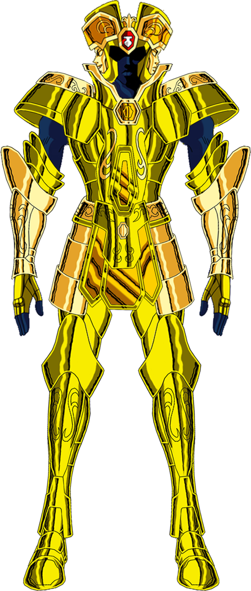
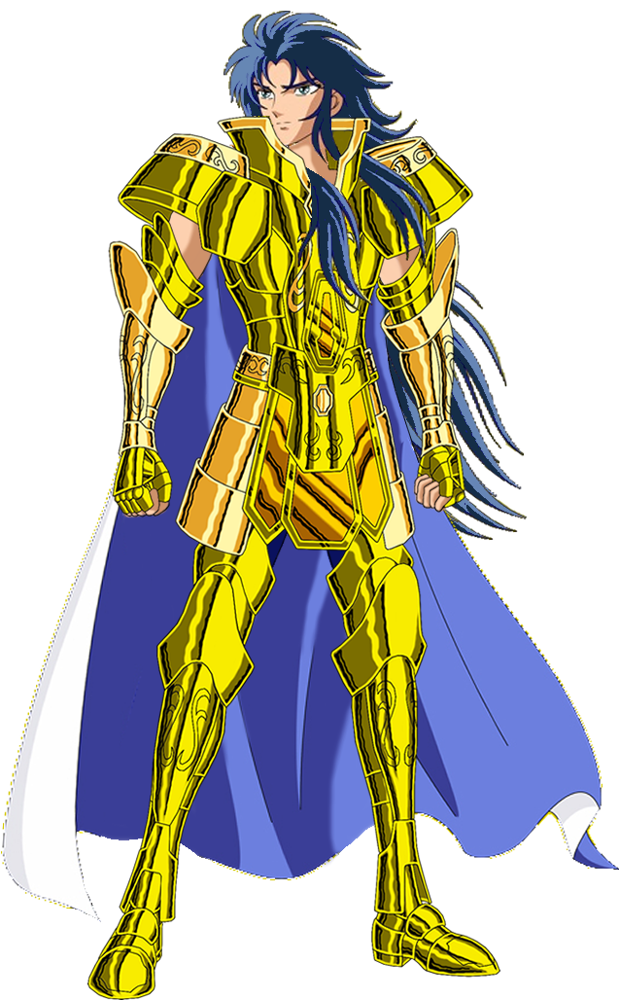
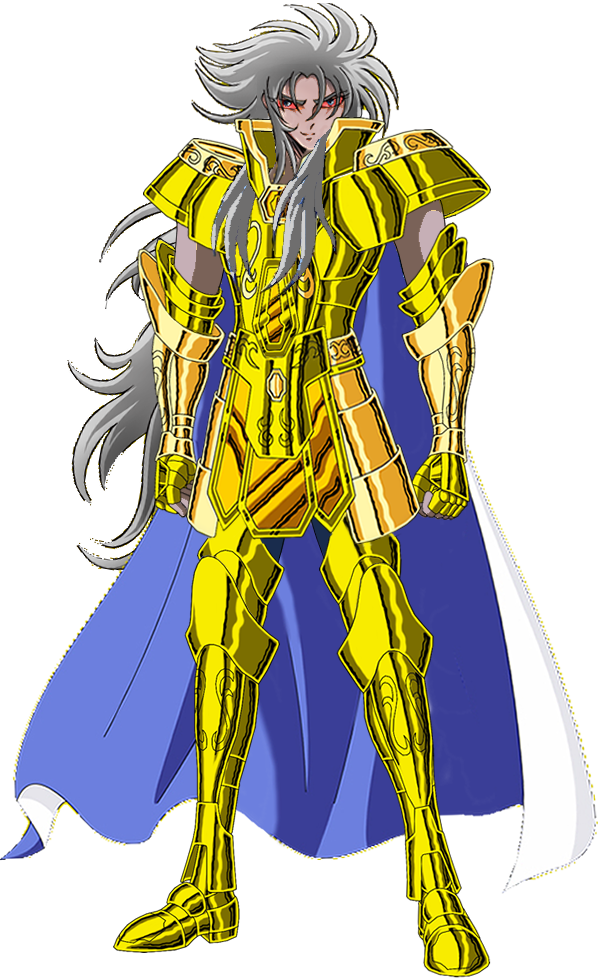

# Gemini

Here are implemented three services. One to receive calls and retrieve user information, and forward to other two services, one for syncronous request/response (Saga) and other to make asyncronous request/response (Kanon).

Gemini, in details, retrieve the corresponding user information with the given access key. With this info, depending on which method for extraction is requested, Saga or Kanon respond with the corresponding data.

Saga and Kannon, connect with our provider framework `Brickwall` in order to retrieve balance and transactions of an specific user.

---

# Kanon

Kanon send to Saggitarius, the card movements of a user to post on the register callback. For more details see [Saggitarius](https://github.com/Finciero/opendata/saggitarius). This action is asyncronous due to the long time that takes retrieving transactions.

---

# Saga

Saga respond with the running balance of a users card over the same channel as the request came. This action is syncronous.

---