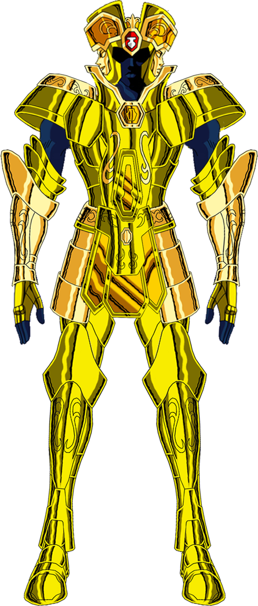

# Geminis

This Service implements to libraries, one to make syncronous request/response (Saga) and other to make asyncronous request/response (Kanon).

Both connect our provider framework `Brickwall` in order to retrieve balance and transactions of an specific user.

Geminis, which use this libraries, retrieve the corresponding user with the given access key. With this, depending on which method for extraction is requested, saga or Kanon response with the corresponding data.

Saga response the data over the same channel as the request came. On the other side, Kanon send to Saggitarius the date data to post on the register callback. For more details see [Saggitarius](https://github.com/Finciero/opendata/saggitarius).
